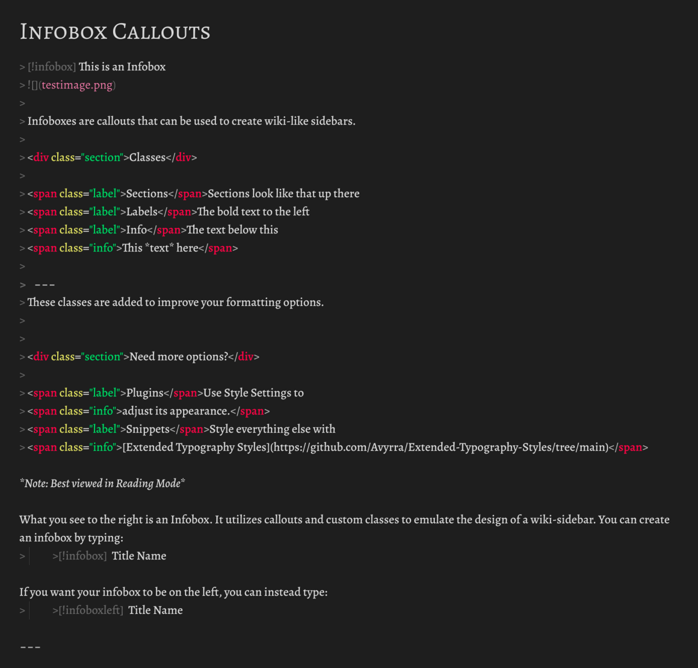

# Install Guide
1. Download infobox-callouts.css
2. Open your vault's snippets folder (vault/.obsidian/snippets) - Can also be found by clicking the folder icon in the appearance options menu
3. Drag infobox-callouts.css into snippets folder
4. Refresh CSS snippets in Appearance Options Menu in Obsidian
5. Enable infobox-callouts

# Stylize your Infoboxes
1. Go to Community plugins menu and turn on Community Plugins
2. Click Browse
3. Search for Style Settings
4. Click on Style Settings. Install it. Then Enable it.
5. A new menu will appear at the bottom of your options menu called Style Settings
6. Enjoy!

# User Guide

You can insert a callout by typing `>[!type]`.  
Within the brackets, replace `type` with the kind of callout you want to use, and Obsidian will render it accordingly.

To make an infobox, use one of the following:
- `>[!infobox]` – defaults to right side
- `>[!infoboxright]` – right side  
- `>[!infoboxleft]` – left side  

After inserting a callout, each new line inside it should begin with `>` to indicate it's part of the same block.
Markdown is fully supported inside callouts. But if you want more structured formatting, a few custom HTML classes are available.

## Classes
Each class must be initiated with HTML. There are three types:  
**Section**, **Label**, and **Info**.

QUICK REFERENCE
`` or ``
`` or ``
`` or ``

You can modify the look of each via **Style Settings** in Obsidian.

## Sections
Sections are used to break up content with a bolder header.
You can start the section class by typing the following: `
` or `
`
You can type the title of your section afterwards. To end the section class, type `
` after your section title. **Once a section class is ended, add an additional line afterwards or Obsidian won't read any markdown after it.**

## Label
Use the label class to anchor a line of text along the left edge of the infobox.

Add a label with `` or `` and type the name of the label immediately afterwards.

After typing the label name, type `` to close it. All text typed on the same line after `` will act as if it were part of the Info Class.

## Info
The info class will anchor text to a margin positioned after a label. This margin can be set within Style Settings. The Info class is usually used for any information that exceeds the bounds of the Label Class.

Add info with `` or `` and type all information afterwards. Text will automatically wrap within this class onto the next line. Afterwards, type `` to close it.

# Tips
1. It is recommended to use Source View in Obsidian when typing an info box. When typing in Live Preview, the automatic rendering may interfere with input.
2. You can download my example vault in order to see exactly how I used it in my example. (Note, you will need the fonts Alegreya and Alegreya SC if you want it to look the same.)
3. Or you can use the image below. It is the source view of my example from above.

